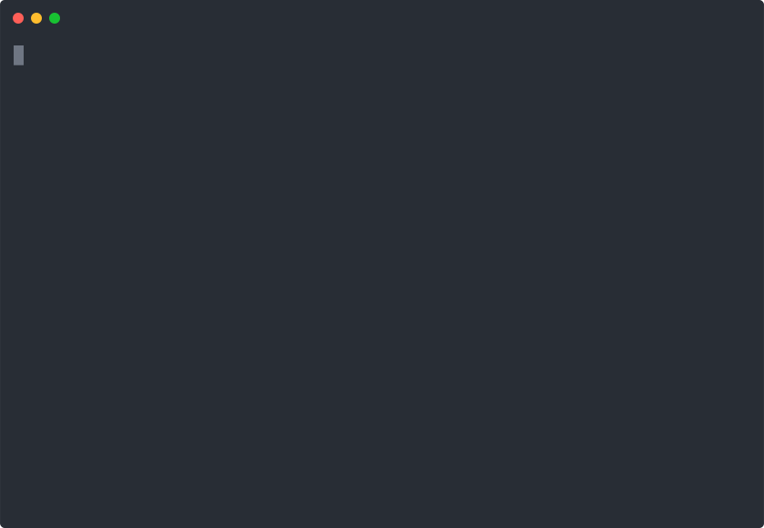

<div align="center">
<!--MOON-->🌑 New Moon<!--END_MOON-->


</div>

<div align="center">


</div>

<br/>

<div align="center">


&nbsp;

&nbsp;


</div>

<div align="center">

[](https://linkedin.com/in/muhammadabdullah-b887272a5)
&nbsp;
[](https://github.com/aboodi679)
&nbsp;
[](mailto:aaboodi679@gmail.com)

</div>

<div align="center">


&nbsp;

&nbsp;


</div>

## Who am I

I'm a Software Engineering graduate who learns by shipping real, production-shaped infrastructure not tutorials. Over the past year I built two multi-service AWS platforms from a blank Terraform state, wiring together event-driven pipelines, containerized microservices, and zero-downtime CI/CD.

My focus is **cloud infrastructure and DevOps engineering**  IaC, container orchestration, observability, and secure automated delivery.

```yaml
role:    Cloud / DevOps Engineer
stack:   AWS · Terraform · ECS Fargate · Docker · GitHub Actions
mindset: "Automate it. Monitor it. Document why."
goal:    Solutions Architect
```

## Terminal

<div align="center">



</div>

<div align="center">


&nbsp;


</div>

## Tech Stack

<div align="center">

**Languages**


**Cloud & Infrastructure**


**AWS Services**


**Backend & Databases**


</div>

## Projects

<details open>
<summary><b>🟣 StatusNest — Multi-Tenant AWS Status Page & Monitoring SaaS &nbsp;|&nbsp; 2026</b></summary>

<br/>

> A production-grade, multi-tenant SaaS platform where businesses monitor their services and display a public status page. Built end-to-end on AWS  100% Terraform IaC, zero manual console interaction.

| | |
|---|---|
| **What it does** | Businesses register services; StatusNest continuously monitors health and displays live UP/DOWN status on a public-facing page in real time |
| **Microservices** | 3 FastAPI microservices on ECS Fargate — API, Worker, Frontend |
| **Data layer** | RDS PostgreSQL · ElastiCache Redis |
| **Monitoring pipeline** | EventBridge → Lambda → SQS  continuous health polling, incident detection under 60 seconds |
| **Edge & security** | CloudFront CDN · WAF · S3 static hosting |
| **CI/CD** | GitHub Actions with OIDC  zero long-lived credentials, Docker build → ECR push → ECS rolling deploy on every commit |
| **Observability** | CloudWatch dashboards + alarms · X-Ray distributed tracing |
| **IaC** | 4 Terraform repos: `statusnest-frontend` · `statusnest-api` · `statusnest-worker` · `statusnest-infra` |
| **Docs** | 8 Architecture Decision Records · Full Solution Architecture Document |

[](https://github.com/aboodi679)

</details>

<details>
<summary><b>🟣 OrderFlow  AWS Event-Driven Microservices Platform &nbsp;|&nbsp; 2026</b></summary>

<br/>

> An order management system built as 3 independent microservices communicating asynchronously  provisioned 100% via Terraform with full CI/CD and observability.

| | |
|---|---|
| **What it does** | End-to-end order lifecycle: placement → inventory deduction → customer notification  fully decoupled and async |
| **Services** | Order Service · Inventory Service · Notification Service  3 independent Flask microservices |
| **Routing** | ALB with path-based routing |
| **Messaging** | EventBridge → SQS → SNS fan-out pipeline |
| **CI/CD** | GitHub Actions with OIDC  Docker build → ECR push → ECS rolling deploy |
| **Observability** | CloudWatch dashboards + alarms · X-Ray distributed tracing |
| **Performance** | Deployment time cut from 15+ minutes (manual) to under 3 minutes |
| **IaC** | 100% Terraform  modular state management |

[](https://github.com/aboodi679)

</details>

<details>
<summary><b>🟣 AI Hitman - Cloud-Integrated Game Backend &nbsp;|&nbsp; 2025-2026</b></summary>

<br/>

> Final year project  a Unity zombie survival game with a fully serverless AWS cloud backend. Sole owner of cloud design, provisioning, deployment, and operations.

| | |
|---|---|
| **What it does** | Unity zombie survival game; enemy AI uses hybrid FSM + Reinforcement Learning (ML-Agents PPO); cloud backend tracks session stats and hosts the ML model |
| **Backend** | Flask REST API deployed serverlessly via Zappa on Lambda  4 live endpoints through API Gateway |
| **Data & storage** | DynamoDB for session statistics · S3 for ML model hosting |
| **IaC** | Fully provisioned via Terraform and boto3  Lambda · DynamoDB · S3 · API Gateway · IAM |
| **Result** | 42/50 · Top 8 Runner-Up at university exhibition |

[](https://github.com/aboodi679/ai-hitman-backend)

</details>

## Achievements

<div align="center">

| Recognition | Details |
|:-----------:|:--------|
| 🏆 Top 8 Runner-Up | AI Hitman FYP scored 42/50 at University of Lahore exhibition |
| 🎓 Class Representative | Elected liaison for 60+ students across 4 academic years (2022-2026) |
| 📊 GPA 3.47 / 4.00 | BS Software Engineering  University of Lahore |
| 🧾 8 Architecture Decision Records | Full architectural decision trail on StatusNest production build |
| ⚡ 80% Faster Deployments | OrderFlow - 15+ min manual deploy → under 3 min automated |
| 🔍 Sub-60s Incident Detection | StatusNest event-driven monitoring pipeline on AWS |

</div>

## Certifications

<div align="center">

**Anthropic**


**Amazon Web Services**


&nbsp;


**Project Management**


</div>

## GitHub Analytics

<div align="center">


&nbsp;


</div>

<div align="center">


</div>

## Contribution Graph

<div align="center">


</div>

## 3D Contribution Graph

<div align="center">


</div>

## Snake

<div align="center">


</div>

## Current Focus

```yaml
# July 2026

learning:
  - AWS Solutions Architect-level networking, security, cost optimisation
  - Advanced Terraform module design and remote state strategies

building:
  - StatusNest case study polishing docs for recruiters

exploring:
  - International cloud/DevOps job market
  - AWS Graduate Cloud Support Associate track

open_to:
  - Cloud Engineer / DevOps Engineer / Cloud Support roles
  - Long-term path: Solutions Architect
```

## Connect

<div align="center">

[](https://linkedin.com/in/muhammadabdullah-b887272a5)
&nbsp;
[](mailto:aaboodi679@gmail.com)
&nbsp;
[](https://github.com/aboodi679)

</div>

<div align="center">
  
<!--QUOTE-->🚀 *Automate everything that can be automated. — Gene Kim*<!--END_QUOTE-->

*"Infrastructure that isn't documented is infrastructure you don't actually understand."*

<br/>


</div>
