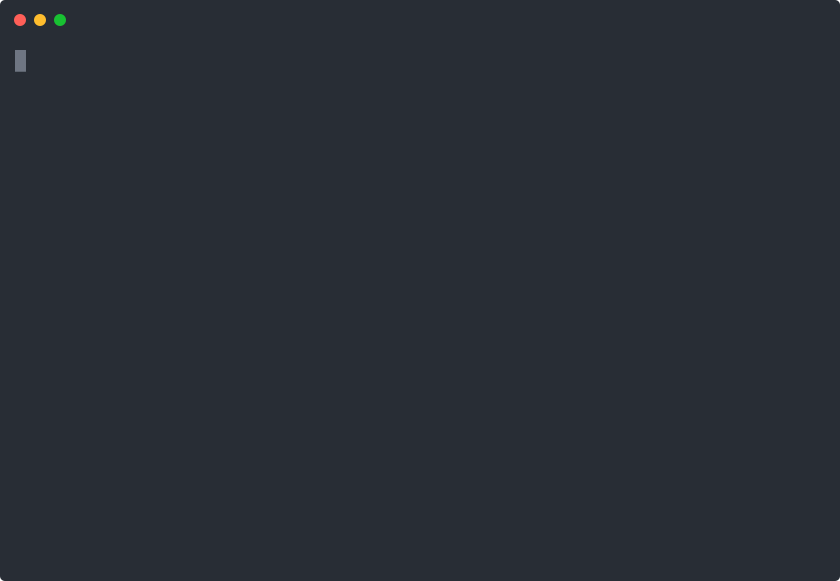

<div align="left">
  <!--MOON-->🌖 Waning Gibbous<!--END_MOON-->
</div>

<div align="center">


</div>

<div align="center">


</div>

<br/>

<div align="center">


&nbsp;

&nbsp;


</div>

<div align="center">

[](https://linkedin.com/in/muhammadabdullah-b887272a5)
&nbsp;
[](https://github.com/aboodi679)
&nbsp;
[](mailto:aaboodi679@gmail.com)

</div>

<div align="center">


&nbsp;

&nbsp;


</div>

## Who am I

I don't wait to be taught. I build until I understand.

I spent the last year going deep on AWS, not through courses alone, but by building real systems from scratch and hitting problems that don't show up in tutorials. Every project pushed me into territory I hadn't covered before. That's intentional.

I take ownership seriously. When something breaks I don't wait for someone else to find it, I stay until I understand exactly what happened and why, and I make sure it doesn't happen again.

I've built everything solo so far, which means I know every layer. But I know the best engineers don't work alone, and I'm ready to bring that foundation into a team where I can go further with people around me.

Open to Cloud Engineer and DevOps roles.

```yaml
mindset: "Automate it. Monitor it. Document why."
goal:    Solutions Architect
```

## Terminal

<div align="center">



</div>

## Tech Stack

<div align="center">

**Languages**


**Cloud & Infrastructure**


**AWS Services**


**Observability**


**Backend & Databases**


</div>

## Certifications

<div align="center">

**Anthropic**


**Amazon Web Services**


&nbsp;

&nbsp;

&nbsp;

&nbsp;


</div>

## Snake

<div align="center">


</div>

## Connect

<div align="center">

[](https://linkedin.com/in/muhammadabdullah-b887272a5)
&nbsp;
[](mailto:aaboodi679@gmail.com)
&nbsp;
[](https://github.com/aboodi679)

</div>

<div align="center">

<!--QUOTE-->🚀 *Monitoring is not optional. It is your eyes in production.*<!--END_QUOTE-->

<br/>


</div>
